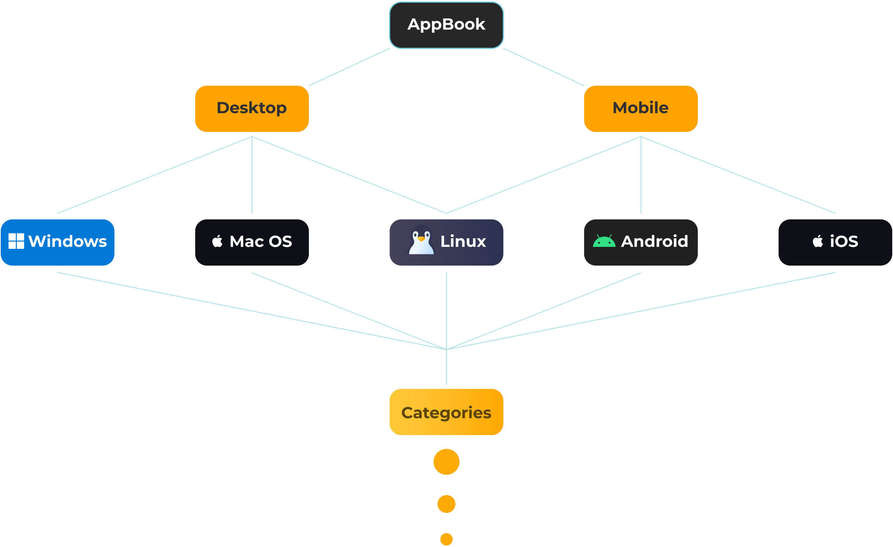

# 📘 AppBook (Not yet complete)
**Better Apps/Alternatives to replace Proprietary software.**

## TODO: Manage and place all of them properly with categories.

## Requirements:

- Preferably Open Source 
- Must be actually good, and worth (No Spyware/Adware or reputedly bad company)
- Add more...
